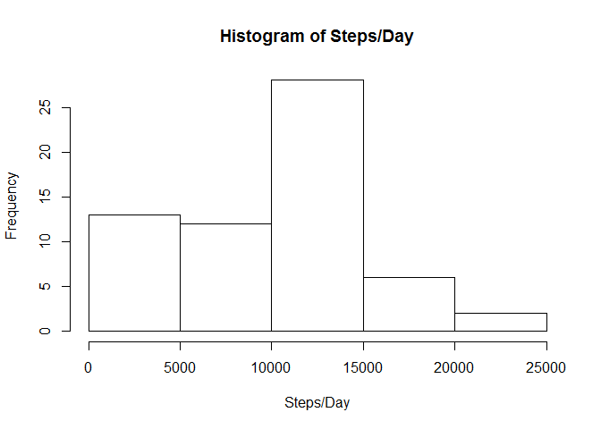
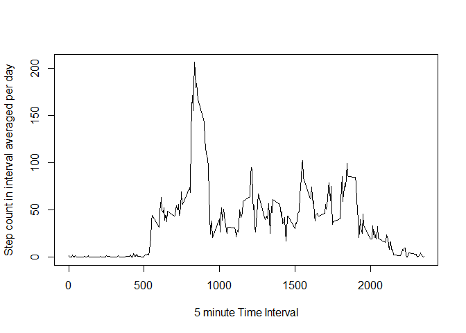
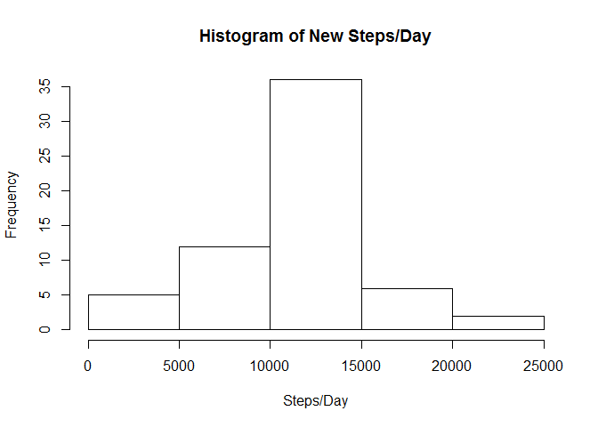
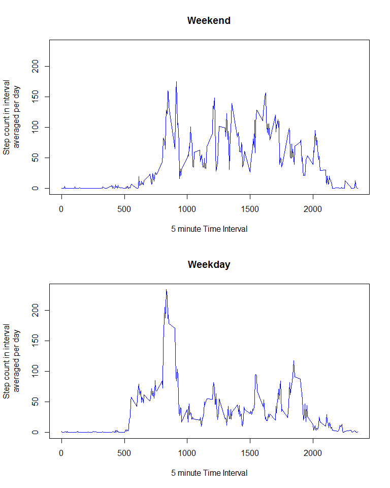

R Markdown
----------

### Loading the data

First of all we load the data:

    data<-read.csv("activity.csv")

Ignoring missing values, we now calculate some summary statistics for
the data, in particular: - the total number of steps taken per day - a
histogram of the total number of steps taken each day - the mean and
median of the total number of steps taken per day

    stepsday<-rowsum(data$steps,data$date,na.rm=T)
    hist(stepsday,xlab="Steps/Day",main="Histogram of Steps/Day")

    mn<-mean(stepsday)
    med<-median(stepsday)
    print(paste("Mean steps/day: ",mn," Median steps/day: ",med,sep=""))

    ## [1] "Mean steps/day: 9354.22950819672 Median steps/day: 10395"

We now make a time series plot to assess the step variation during the
day by computing the mean step count over all days in each time
interval. The horizontal axis shows the 5 minute step interval and
identify the time interval in the day where the step count is greatest.

    intervals<-unique(data$interval)
    steptimeseries<-tapply(data$steps,data$interval,mean,na.rm=T)
    plot(intervals,steptimeseries,xlab="5 minute Time Interval",ylab="Step count in interval averaged per day",type="l")

    modalinterval<-intervals[which(steptimeseries==max(steptimeseries),arr.ind=T)]
    print(paste("The time interval during which the most steps were made is: ",modalinterval,". In this interval, ",as.integer(max(steptimeseries))," steps were made.",sep=""))

    ## [1] "The time interval during which the most steps were made is: 835. In this interval, 206 steps were made."

We now consider the missing values by computing how many there are, and
then imputing values for them as the mean number of steps for a
particular time interval averaged over all days.A new dataset is created
with these values filled in.

    numna<-sum(is.na(data$steps))
    print(paste("There are ",numna," missing values in the dataset.",sep=""))

    ## [1] "There are 2304 missing values in the dataset."

    imputedsteps<-data$steps
    mnsteps<-imputedsteps
    i<-1
    for(i in 1:dim(data)[1]){
      mnsteps[i]<-steptimeseries[which(intervals==data$interval[i],arr.ind=T)][[1]]
      if(is.na(imputedsteps[i])){
        imputedsteps[i]<-as.integer(mnsteps[i])
      }
      i<-i+1
    }
    ##Create a new dataset with these values.
    newdata<-data
    newdata$steps<-imputedsteps

To assess the impact of filling in the missing values we recaluclate the
summary statistics from before and plot a new histogram of the step
count:

    newstepsday<-rowsum(newdata$steps,newdata$date)
    hist(newstepsday,xlab="Steps/Day",main="Histogram of New Steps/Day")

    newmn<-mean(newstepsday)
    newmed<-median(newstepsday)
    print(paste("The new mean and median steps/day are: ",newmn, " and ",newmed," respectively.",sep=""))

    ## [1] "The new mean and median steps/day are: 10749.7704918033 and 10641 respectively."

In this case, the imputation of missing values has increased the mean
and median step count/day.

### Weekday vs Weekend activity

We can now make a comparison between the time series for weekday and
weekend activity as follows:

    weeknds<-(weekdays(as.Date(data$date))=="Sunday")|(weekdays(as.Date(data$date))=="Saturday")
    wkends<-factor((as.numeric(weeknds)+1),labels=c("weekday","weekend"))
    steptimeserieswkend<-tapply(data$steps[wkends=="weekend"],data$interval[wkends=="weekend"],mean,na.rm=T)
    steptimeserieswk<-tapply(data$steps[wkends=="weekday"],data$interval[wkends=="weekday"],mean,na.rm=T)
    par(mfrow=c(2,1),mar=c(5.1,5.1,4.1,2.1))
    plot(intervals,steptimeserieswkend,xlab="5 minute Time Interval",ylab="Step count in interval\naveraged per day",ylim=c(0,max(c(steptimeserieswkend,steptimeserieswk))),type="l",col="blue",main="Weekend")
    plot(intervals,steptimeserieswk,xlab="5 minute Time Interval",ylab="Step count in interval\naveraged per day",ylim=c(0,max(c(steptimeserieswkend,steptimeserieswk))),type="l",col="blue",main="Weekday")

We can see the increased number of steps on weekdays around the morning
commute, and to a lesser extent, the evening commute. In contrast, the
weekend step count is less spiked around these times of day.
